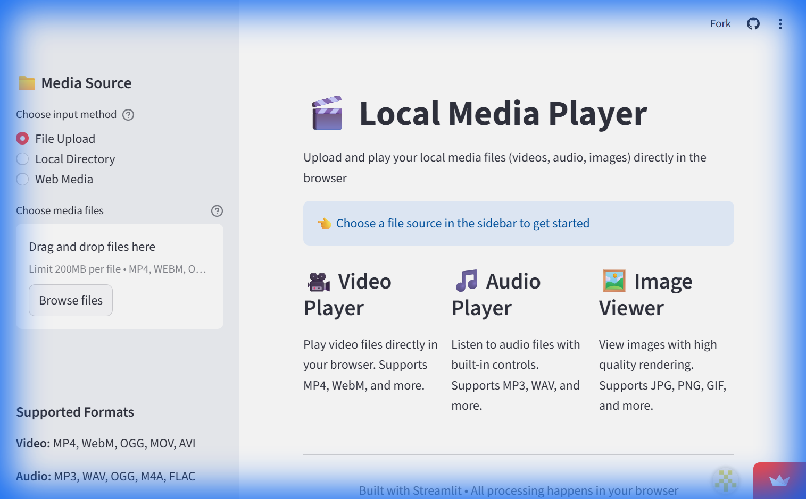
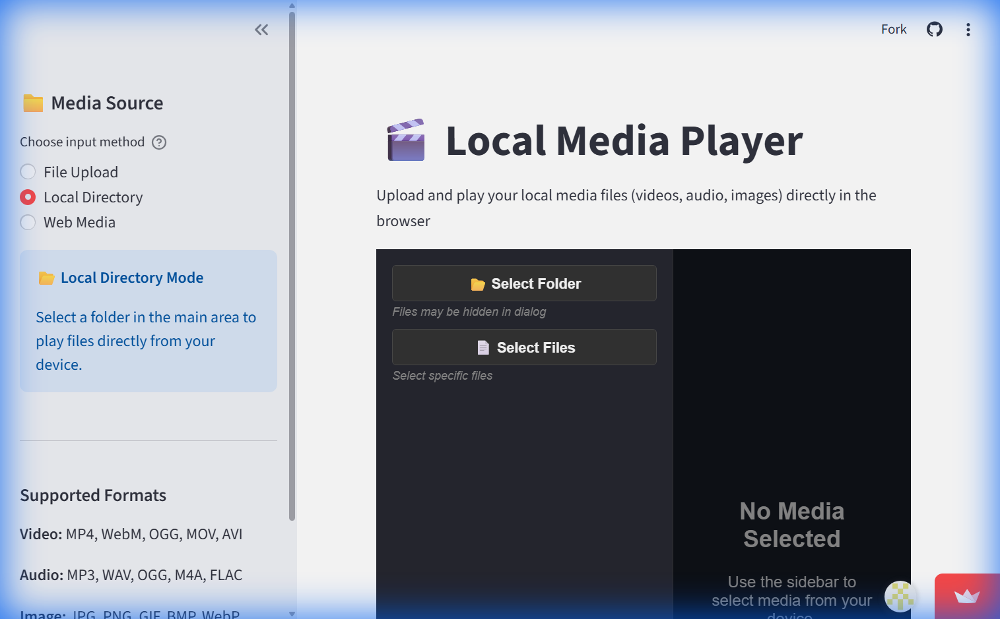
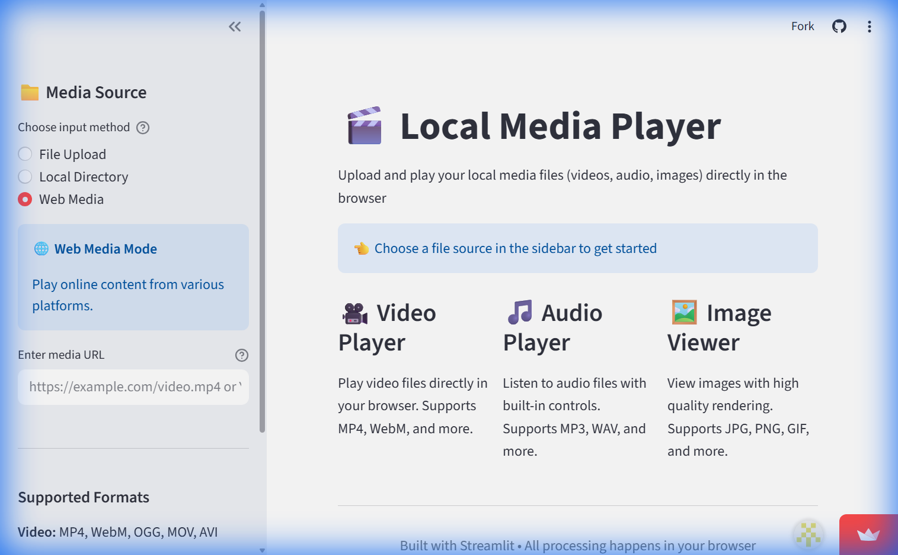

# 🎬 Local Media Player

A simple and elegant Streamlit web application for playing local media files directly in your browser. Upload and enjoy your videos, audio files, and images without leaving the browser!

## ✨ Features

- **Multi-format Support**: Play videos (MP4, WebM, OGG, MOV, AVI), audio (MP3, WAV, OGG, M4A, FLAC), and view images (JPG, PNG, GIF, BMP, WebP)
- **Multiple Files**: Upload and manage multiple media files simultaneously with tabbed interface
- **Browser-based**: All processing happens in your browser - no server-side storage
- **File Information**: View file name, size, and type at a glance
- **Download Option**: Download any uploaded file directly from the player
- **Responsive Design**: Clean, modern interface that works on desktop and mobile
- **🤖 Built-in API**: Query parameter-based endpoints for automation and browser tools (works on Streamlit Cloud) - see [API_USAGE.md](API_USAGE.md)

## 📸 Screenshots

### Main Interface (Upload and play maximum 200MB)


### Local Directory Mode (Play files from local directory - no upload required)


### Web Media Mode (Play media from the web - no upload required)


## 🚀 Getting Started

### Prerequisites

- Python 3.8 or higher
- pip (Python package installer)

### Installation

1. Clone the repository:
```bash
git clone https://github.com/ly2xxx/local-media-player.git
cd local-media-player
```

2. Install dependencies:
```bash
pip install -r requirements.txt
```

3. Run the application:
```bash
streamlit run app.py
```

4. Open your browser and navigate to `http://localhost:8501`

### API Endpoints (for programmatic access)

The app includes built-in API endpoints for automation (no separate server needed):

```bash
# Health check
curl "http://localhost:8501/?api=health"

# List files
curl "http://localhost:8501/?api=list"

# Delete file
curl "http://localhost:8501/?api=delete&filename=video.mp4"
```

See [API_USAGE.md](API_USAGE.md) for full documentation and browser automation examples.

## 📖 Usage

1. **Upload Files**: Click the "Browse files" button in the sidebar or drag and drop media files
2. **Play Media**: Your files will appear in separate tabs - click to view/play
3. **View Info**: Each file displays its name, size, and type
4. **Download**: Use the download button to save any file

## 🎯 Supported Formats

### Video
- MP4
- WebM
- OGG
- MOV
- AVI

### Audio
- MP3
- WAV
- OGG
- M4A
- FLAC

### Images
- JPG/JPEG
- PNG
- GIF
- BMP
- WebP

## 🛠️ Technology Stack

- **Streamlit**: Web framework for data applications
- **Python**: Backend programming language

## 📝 License

This project is open source and available under the MIT License.

## 🤝 Contributing

Contributions, issues, and feature requests are welcome! Feel free to check the issues page.

## 👤 Author

Built with ❤️ using Streamlit

## 🌟 Show Your Support

Give a ⭐️ if this project helped you!
